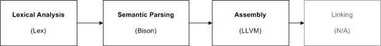
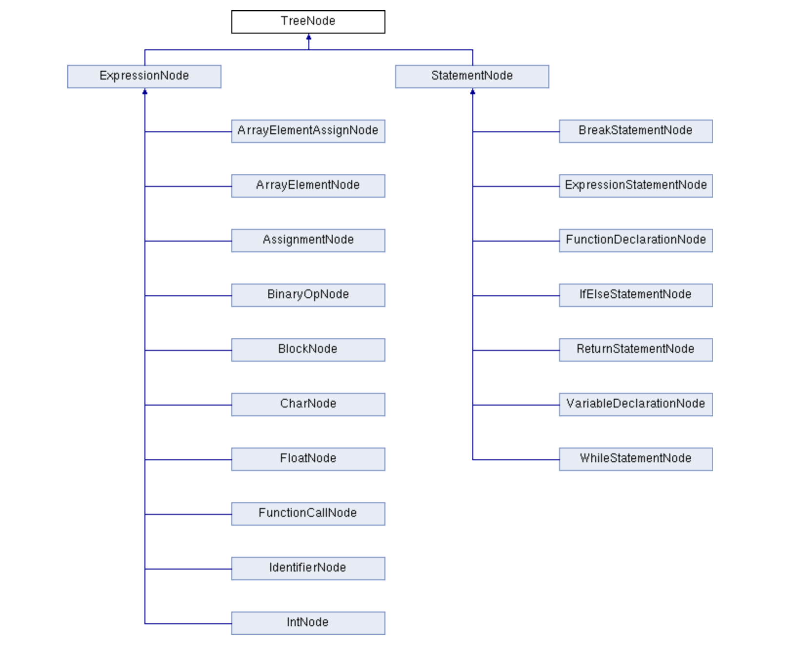

# 编译原理实验报告


## 摘要 



## 目录

TODO: 写完之后自动生成

## 运行环境

基于 C++，我们使用了 `CMakeList.txt` 配置工程，理论上可以在多个平台上构建编译运行。

### 包依赖

- `flex`
- `bison`
- `llvm-10`

### 可视化结果显示

- 推荐使用VS Code插件 live server

## 词法分析 -- Lex

### flex 简介

- flex 是指 fast lexical analyzer generator，用于产生词法分析器。

- flex的输入是文件或输入设备，这些输入中的信息以正则表达式和C代码的形式组成，这些形式被称为规则（rule）。
- 该文件通过编译生成可执行的文件。
- 当可执行文件被执行时，其分析输入中可能存在的符合规则的内容，当找到任何一个正则表达式相匹配内容时，相应的C代码将被执行。

flex的输入文件由3段组成，用一行中只有%%来分隔；

```lex
definition
%%
rules
%%
user's code
```


### 设计语言

我们决定设计实现一个 C语言的子集，类似于学习去年数据库系统课MiniSQL的命名，我们将设计的语言称为 MiniC，实现一部分 C语言的功能。

目前为止，我们的语言支持的 tokens 有：

- `int`, `float`, `char`
- `*`(乘法，不支持指针), `/`, `+`, `-`
- `=`
- `==`, `<=`, `>=`, `<`, `>`, `&&`, `||`, `!`
- C 语言的基本语句分隔符，如 `()`, `[]`, `{}`, `;`
- `if`, `else`, `while`, `break`, `return`

### 实现 token.l

我们选择根据我们设计的语言，对 [ANSI C grammar, Lex specification](http://www.lysator.liu.se/c/ANSI-C-grammar-l.html) 进行精简，得到我们的 token.l 文件。

TODO: 可以把最后精简后的代码贴到这里

## 语法分析 -- Yacc (Bison)

### Yacc 简介

Yacc (Yet Another Compiler Compiler)，是一个经典的生成语法分析器的工具。yacc生成的编译器主要是用C语言写成的语法解析器（Parser），需要与词法解析器Lex一起使用，再把两部分产生出来的C程序一并编译。

### Bison 简介

Bison是一种通用解析器生成器，它将带注释的上下文无关文法转换为使用LALR（1）解析器表的确定性LR或广义LR（GLR）解析器 。作为一项实验性功能，Bison还可以生成IELR（1）或规范的LR（1）解析器表。一旦您精通Bison，就可以使用它来开发各种语言解析器，从用于简单台式计算器的语言解析器到复杂的编程语言。 Bison与Yacc向上兼容：所有正确编写的Yacc语法都应与Bison一起使用，而无需进行任何更改。熟悉Yacc的任何人都应该可以轻松使用Bison。

与 flex 类似，bison 的输入文件也由3段组成，用一行中只有%%来分隔；

```lex
definition
%%
rules
%%
user's code
```


### 设计 AST

flex 和 bison 会将输入的程序文本解析为语法树 (AST, Abstract syntax tree) 的形式。我们先根据我们的实际需求，定义了语法树的节点类型。



### 实现 parsing.y

根据我们定义的语义，我们使用终结符和非终结符来声明每个有效语句和表达式的组成，就像 BNF 语法。语法也类似，例如：

```bnf
expression:
    identifier '=' expression {
        $$ = new AssignmentNode(*$<identifier>1, *$3, yylineno);
    }
    | identifier '(' call_args ')' {
        $$ = new FunctionCallNode(*$1, *$3, yylineno);
    }
    | identifier {
        $<identifier>$ = $1;
    }
    | expression MUL expression {
        $$ = new BinaryOpNode($2, *$1, *$3, yylineno);
    }
    | expression DIV expression {
        $$ = new BinaryOpNode($2, *$1, *$3, yylineno);
    }
    | expression PLUS expression {
        $$ = new BinaryOpNode($2, *$1, *$3, yylineno);
    }
    ······
    | const_value;
```

### AST 抽象语法树的可视化

#### AST 的文件表示

我们使用`Json`格式对AST进行表示。格式如下：

``` json
{
  "name": "{Node's name}",
  "children": [
    {
      "name": "{Child-1's name}",
      ...
    },
    ...
    {
      "name": "{Child-n's name}",
      ...
    }
  ]
}
```


#### AST Json形式文件的生成

我们在基类节点(`TreeNode`)中定义了虚函数`generateJson()`，并在每种子类节点中都实现了`generateJson()` 函数。这一函数用于将本结点表示为Json的格式。每个节点都可能会有它的子节点，所以`generateJson()` 函数会被不断的以深度优先搜索的顺序被调用。下面是`IfElseStatementNode`类的一个示例：

``` c++
void IfElseStatementNode::generateJson(string &s) {
    s.append("\n{\n");
    s.append("\"name\" : \"IfElseStatement\",\n");
    s.append("\"children\" : \n[");
    
    this->expression.generateJson(s);
    s.append(",");
    this->ifBlock.generateJson(s);
    s.append(",");
    this->elseBlock.generateJson(s);

    s.append("\n]\n");
    s.append("}");
}
```

#### AST Json文件的可视化

D3... @dontnet-wuenze 

这里在放两张可视化的图，注意把图片放到report.assets文件夹下


## 语义分析

TODO: 

## 生成可执行文件

听 yrq 说是`lli`一下输出的.ll 文件就可以了

## 测试


## 总结

