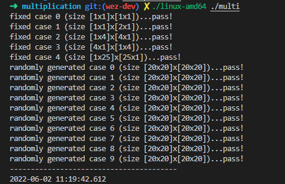

# 编译原理实验报告

**小组成员：吴恩泽 王晓 李博睿**

*5/22/2022*

## 摘要 

我们的MiniC编译器实际上是由三到四个组件构成的，其中数据以 pipeline 的方式从一个组件传送到下一个组件。我们将使用不同的工具来帮助构建这些组件。这是每个步骤我们所使用的工具：


为了进行我们的词法分析，我们使用了开源工具 Lex，目前主要以[Flex](http://flex.sourceforge.net/)的形式提供。Lex 通常与语义解析密切相关，我们将在 Yacc ([Bison](https://www.gnu.org/software/bison/)) 的帮助下执行语义解析。语义解析完成后，我们通过 AST 生成我们的字节码并且可视化我们的 AST。在此，我们使用了[LLVM](https://llvm.org/)，它可以生成中间字节码，然后我们会使用 LLVM 的 `lli` 编译在我们的机器上执行此字节码。

总的来说，我们：

1. **使用*Flex*进行词法分析**：将输入数据拆分为一组标记（标识符、关键字、数字、括号、加减号等）
2. **使用*Bison*进行语义解析**：在解析tokens时生成 AST。Bison 将在这里完成大部分工作，我们只需要定义我们的 AST。 
3. **使用*LLVM*组装**：遍历 AST 并为每个节点生成字节码。


## 目录

[TOC]

## 运行环境

基于 C++，我们使用了 `CMakeList.txt` 配置工程，理论上可以在多个平台上构建编译运行。

### 包依赖

- `flex`
- `bison`
- `llvm-10`

### 可视化结果显示

- 推荐使用VS Code插件 live server

## 词法分析 -- Lex

### flex 简介

- flex 是指 fast lexical analyzer generator，用于产生词法分析器。

- flex的输入是文件或输入设备，这些输入中的信息以正则表达式和C代码的形式组成，这些形式被称为规则（rule）。
- 该文件通过编译生成可执行的文件。
- 当可执行文件被执行时，其分析输入中可能存在的符合规则的内容，当找到任何一个正则表达式相匹配内容时，相应的C代码将被执行。

flex的输入文件由3段组成，用一行中只有%%来分隔；

```lex
definition
%%
rules
%%
user's code
```


### 设计语言

我们决定设计实现一个 C语言的子集，类似于学习去年数据库系统课MiniSQL的命名，我们将设计的语言称为 MiniC，实现一部分 C语言的功能。

目前为止，我们的语言支持的 tokens 有：

- `int`, `float`, `char`
- `*`, `/`, `+`, `-`
- `=`
- `==`, `<=`, `>=`, `<`, `>`, `&&`, `||`, `!`, `&`(取地址符)
- C 语言的基本语句分隔符，如 `()`, `[]`, `{}`, `;`
- `if`, `else`, `while`, `break`, `return`

### 实现 token.l

我们选择根据我们设计的语言，对 [ANSI C grammar, Lex specification](http://www.lysator.liu.se/c/ANSI-C-grammar-l.html) 进行精简，得到我们的 token.l 文件。

```c
D            [0-9]
L            [a-zA-Z_]
H            [a-fA-F0-9]
E            ([Ee][+-]?{D}+)

    /* match two types of comments */
"/*"            { comment();               }
"//"[^\n]*      { /* consume //-comment */ }

    /* match all the necessary keywords */
"break"         { count(); return TOKEN(BREAK);    }
"else"          { count(); return TOKEN(ELSE);     }
"if"            { count(); return TOKEN(IF);       }
"return"        { count(); return TOKEN(RETURN);   }
"while"         { count(); return TOKEN(WHILE);    }

    /* identifiers */
{L}({L}|{D})*            { count(); SAVE_TOKEN; return IDENTIFIER;}

    /* constants */
0[xX]{H}+                { count(); SAVE_TOKEN; return CONSTANT_INT; /* hexadecimal */ }
0[0-7]*                  { count(); SAVE_TOKEN; return CONSTANT_INT; /* octal */       }
[1-9]{D}*                { count(); SAVE_TOKEN; return CONSTANT_INT; /* decimal */     }

\'.\'|\'\\.\'            { count(); SAVE_TOKEN; return CONSTANT_CHAR; /* character */  }
\"(\\.|[^"\\])*\"      { count(); SAVE_TOKEN; return CONSTANT_STRING; /* string */    }


{D}+{E}                  { count(); SAVE_TOKEN; return CONSTANT_FLOAT; }
{D}*"."{D}+{E}?          { count(); SAVE_TOKEN; return CONSTANT_FLOAT; }
{D}+"."{D}*{E}?          { count(); SAVE_TOKEN; return CONSTANT_FLOAT; }


    /* operators */
"&&"            { count(); return TOKEN(AND); }
"||"            { count(); return TOKEN(OR); }
"<="            { count(); return TOKEN(LEQ); }
">="            { count(); return TOKEN(GEQ); }
"=="            { count(); return TOKEN(EQU); }
"!="            { count(); return TOKEN(NEQ); }
";"             { count(); return TOKEN(';'); }
"{"             { count(); return TOKEN('{'); }
"}"             { count(); return TOKEN('}'); }
","             { count(); return TOKEN(','); }
":"             { count(); return TOKEN(':'); }
"="             { count(); return TOKEN('='); }
"("             { count(); return TOKEN('('); }
")"             { count(); return TOKEN(')'); }
"["             { count(); return TOKEN('['); }
"]"             { count(); return TOKEN(']'); }
"."             { count(); return TOKEN('.'); }
"&"             { count(); return TOKEN('&'); }
"!"             { count(); return TOKEN('!'); }
"~"             { count(); return TOKEN('~'); }
"-"             { count(); return TOKEN(MINUS); }
"+"             { count(); return TOKEN(PLUS); }
"*"             { count(); return TOKEN(MUL); }
"/"             { count(); return TOKEN(DIV); }
"%"             { count(); return TOKEN('%'); }
"<"             { count(); return TOKEN(LESST); }
">"             { count(); return TOKEN(GREATERT); }
"^"             { count(); return TOKEN('^'); }
"|"             { count(); return TOKEN('|'); }
"?"             { count(); return TOKEN('?'); }

[ \t\v\n\f]     { count(); }
.               { printf("unknown token : %s in line: %d\n", yytext, yylineno); }
```


## 语法分析 -- Yacc (Bison)

### Yacc 简介

Yacc (Yet Another Compiler Compiler)，是一个经典的生成语法分析器的工具。yacc生成的编译器主要是用C语言写成的语法解析器（Parser），需要与词法解析器Lex一起使用，再把两部分产生出来的C程序一并编译。

### Bison 简介

Bison是一种通用解析器生成器，它将带注释的上下文无关文法转换为使用LALR（1）解析器表的确定性LR或广义LR（GLR）解析器 。作为一项实验性功能，Bison还可以生成IELR（1）或规范的LR（1）解析器表。一旦您精通Bison，就可以使用它来开发各种语言解析器，从用于简单台式计算器的语言解析器到复杂的编程语言。 Bison与Yacc向上兼容：所有正确编写的Yacc语法都应与Bison一起使用，而无需进行任何更改。熟悉Yacc的任何人都应该可以轻松使用Bison。

与 flex 类似，bison 的输入文件也由3段组成，用一行中只有%%来分隔；

```lex
definition
%%
rules
%%
user's code
```


### 设计 AST

flex 和 bison 会将输入的程序文本解析为语法树 (AST, Abstract syntax tree) 的形式。我们先根据我们的实际需求，定义了语法树的节点类型。


### 实现 parsing.y

根据我们定义的语义，我们使用终结符和非终结符来声明每个有效语句和表达式的组成，就像 BNF 语法。语法也类似，例如：

```bnf
expression:
    identifier '=' expression {
        $$ = new AssignmentNode(*$<identifier>1, *$3, yylineno);
    }
    | identifier '(' call_args ')' {
        $$ = new FunctionCallNode(*$1, *$3, yylineno);
    }
    | identifier {
        $<identifier>$ = $1;
    }
    | expression MUL expression {
        $$ = new BinaryOpNode($2, *$1, *$3, yylineno);
    }
    | expression DIV expression {
        $$ = new BinaryOpNode($2, *$1, *$3, yylineno);
    }
    | expression PLUS expression {
        $$ = new BinaryOpNode($2, *$1, *$3, yylineno);
    }
    ······
    | const_value;
```

### AST 抽象语法树的可视化

#### AST 的文件表示

我们使用`Json`格式对AST进行表示。格式如下：

``` json
{
  "name": "{Node's name}",
  "children": [
    {
      "name": "{Child-1's name}",
      ...
    },
    ...
    {
      "name": "{Child-n's name}",
      ...
    }
  ]
}
```


#### AST Json形式文件的生成

我们在基类节点(`TreeNode`)中定义了虚函数`generateJson()`，并在每种子类节点中都实现了`generateJson()` 函数。这一函数用于将本结点表示为Json的格式。每个节点都可能会有它的子节点，所以`generateJson()` 函数会被不断的以深度优先搜索的顺序被调用。下面是`IfElseStatementNode`类的一个示例：

``` c++
void IfElseStatementNode::generateJson(string &s) {
    s.append("\n{\n");
    s.append("\"name\" : \"IfElseStatement\",\n");
    s.append("\"children\" : \n[");
    
    this->expression.generateJson(s);
    s.append(",");
    this->ifBlock.generateJson(s);
    s.append(",");
    this->elseBlock.generateJson(s);

    s.append("\n]\n");
    s.append("}");
}
```

#### AST Json文件的可视化

D3... @dontnet-wuenze 

quicksort 中一个while 语句对应的语法树


if 语句的一部分(太大了放不下)


## 语义分析

#### LLVM简介：

LLVM是构架编译器(compiler)的框架系统，以C++编写而成，用于优化以任意程序语言编写的程序的编译时间(compile-time)、链接时间(link-time)、运行时间(run-time)以及空闲时间(idle-time)，对开发者保持开放，并兼容已有脚本。

对关注编译技术的开发人员，LLVM提供了很多优点：

**现代化的设计**

LLVM的设计是高度模块化的，使得其代码更为清晰和便于排查问题所在。

**语言无关的中间代码**

一方面，这使得透过LLVM能够将不同的语言相互连结起来；也使得LLVM能够紧密地与IDE交互和集成。

另一方面，发布中间代码而非目标代码能够在目标系统上更好地发挥其潜能而又不伤害可调试性（i.e. 在目标系统上针对本机的硬件环境产生目标代码，但又能够直接通过中间代码来进行行级调试）

**作为工具和函数库**

使用LLVM提供的工具可以比较容易地实现新的编程语言的优化编译器或VM，或为现有的编程语言引入一些更好的优化/调试特性


#### 完成目标：

要提供整个程序的主入口，对语法分析后得到的抽象语法树进行语义分析，得到每个节点对应的LLVM::Value的值，并生成中间代码，即LLVMIR代码，以便为后面的运行做铺垫；


#### treenode.cpp分析

此文件主要实现每个Node节点中对应的**emitter(emitContext &emitContext)**方法，为每种不同种类的节点实现生成LLVMIR中间代码；

先定义全局的上下文myContext及llvm::IRbuilder；

```c++
extern llvm::LLVMContext myContext; //定义全局context
extern llvm::IRBuilder<> myBuilder; //定义全局IRbuilder
```


我们需要一个symbolTable类作为符号表存储块内的变量表 local_var 及对应的变量-llvm 类型表 local_var_type；

```c++
class symbolTable{ 
public:
    map<string, llvm::Value*> local_var; //局部变量 map
    map<string, llvm::Type*> local_var_type;//局部变量 string-llvm::type 的 map
};
```


EmitContext类主要存储了一个符号栈，同时存有 LLVM::module 以及所定义的输入输出函数；

```c++
class EmitContext{
public:
    vector<symbolTable *> symbolTable_stack; //符号栈

public:
    llvm::Module *myModule; 
    llvm::Function *printf,*scanf, *gets;
    llvm::Function* currentFunc;
    llvm::BasicBlock* returnBB;
    llvm::Value* returnVal;
    bool isArgs;
    bool hasReturn;
    ……
```


表示整形、浮点型、字符常量，和字符串常量的节点emitter函数：传入全局上下文myContext，分别返回了其对应的LLVM::constant种类；

```c++
llvm::Value* IntNode::emitter(EmitContext &emitContext){
    cout << "IntNode : " << value <<endl;
    return llvm::ConstantInt::get(llvm::Type::getInt32Ty(myContext),value,true);
}

llvm::Value* FloatNode::emitter(EmitContext &emitContext){
    cout << "FloatNode : " << value <<endl;
    return llvm::ConstantFP::get(llvm::Type::getFloatTy(myContext),value);
}

llvm::Value* CharNode::emitter(EmitContext &emitContext){  //----------  -_-
    cout << "CharNode : " << value <<endl;
    if (this->value.size() == 3)
        return myBuilder.getInt8(this->value.at(1));
    else {
        if (this->value.compare("'\\n'") == 0) {
            return myBuilder.getInt8('\n');
        } else if (this->value.compare("'\\\\'") == 0){
            return myBuilder.getInt8('\\');
        } else if (this->value.compare("'\\a'") == 0){
            return myBuilder.getInt8('\a');
        } else if (this->value.compare("'\\b'") == 0){
            return myBuilder.getInt8('\b');
        } else if (this->value.compare("'\\f'") == 0){
            return myBuilder.getInt8('\f');
        } else if (this->value.compare("'\\t'") == 0){
            return myBuilder.getInt8('\t');
        } else if (this->value.compare("'\\v'") == 0){
            return myBuilder.getInt8('\v');
        } else if (this->value.compare("'\\''") == 0){
            return myBuilder.getInt8('\'');
        } else if (this->value.compare("'\\\"'") == 0){
            return myBuilder.getInt8('\"');
        } else if (this->value.compare("'\\0'") == 0){
            return myBuilder.getInt8('\0');
        } else {
            throw logic_error("[ERROR] char not defined: " + this->value);
        }
    }
    return nullptr;
}

// StringNode 返回值是首地址
llvm::Value* StringNode::emitter(EmitContext &emitContext) {
    cout << "StringNode : " << value <<endl;
    string str = value.substr(1, value.length() - 2);
    string after = string(1, '\n');
    int pos = str.find("\\n");
    while(pos != string::npos) {
        str = str.replace(pos, 2, after);
        pos = str.find("\\n");
    }
    llvm::Constant *strConst = llvm::ConstantDataArray::getString(myContext, str);
    
    llvm::Value *globalVar = new llvm::GlobalVariable(*(emitContext.myModule), strConst->getType(), true, llvm::GlobalValue::PrivateLinkage, strConst, "_Const_String_");
    vector<llvm::Value*> indexList;
    indexList.push_back(myBuilder.getInt32(0));
    indexList.push_back(myBuilder.getInt32(0));
    // var value
    llvm::Value * varPtr = myBuilder.CreateInBoundsGEP(globalVar, llvm::ArrayRef<llvm::Value*>(indexList), "tmpstring");
    return varPtr;
}
```


IdentifierNode节点emitter函数分析：首先在符号栈中按照变量域从近到远搜索，若没有搜索到，再查询全局变量，若仍没有，则表明此标识符并未被声明，会报错；接着调用loadinst函数，产生一条load指令，加载此标识符的值；

```c++
llvm::Value* IdentifierNode::emitter(EmitContext &emitContext){
    cout << "IdentifierNode : " << name << endl;

    llvm::Value* variable = emitContext.findVariable(name);
    if(variable == nullptr){
        std::cerr << "undeclared variable " << name << endl;
        return nullptr;
    }
    llvm::Type* tp = variable->getType()->getPointerElementType();
    llvm::outs()<<"identifier type:"<<*tp;
    cout<<endl;

    llvm::Value* res = nullptr;
    // 如果传入的是一个数组的 ID
    if(tp->isArrayTy()) {
        vector<llvm::Value*> indexList;
        indexList.push_back(myBuilder.getInt32(0));
        indexList.push_back(myBuilder.getInt32(0));
        res = myBuilder.CreateInBoundsGEP(variable, indexList, "arrayPtr");
    }
    else {
        res = new llvm::LoadInst(tp, variable, "LoadInst", false, myBuilder.GetInsertBlock());
    }
    return res;
}
```


对于为数组成员的identifierNode节点emitter函数分析：首先找到其数组名对应的llvm::value，再得到其下标index值，再调用IRbuilder里的createInBoundsGEP函数，得到数组中对应元素的值，这里的数组标识符可能是数组类型，也可能是指针类型，对于两种类型要进行不同的处理；

```C++
llvm::Value* ArrayElementNode::emitter(EmitContext &emitContext){
    cout << "ArrayElementNode : " << identifier.name << "[]" << endl;

    llvm::Value* arrayValue = emitContext.findVariable(identifier.name);
    if(arrayValue == nullptr){
        cerr << "undeclared array " << identifier.name << endl;
		return nullptr;
    }

    llvm::Value* indexValue = index.emitter(emitContext);
    vector<llvm::Value*> indexList;

    // 如果是一个指针
    if(arrayValue->getType()->getPointerElementType()->isPointerTy()) {
        arrayValue = myBuilder.CreateLoad(arrayValue->getType()->getPointerElementType(), arrayValue);
        indexList.push_back(indexValue);    
    }
    // 如果是一个数组 
    else {
        indexList.push_back(myBuilder.getInt32(0));
        indexList.push_back(indexValue);    
    }

    llvm::Value* elePtr =  myBuilder.CreateInBoundsGEP(arrayValue, llvm::ArrayRef<llvm::Value*>(indexList), "tmparray");
    return myBuilder.CreateLoad(elePtr->getType()->getPointerElementType(), elePtr, "tmpvar");
    //return myBuilder.CreateAlignedLoad(elePtr, 4);
}

```


调用函数时，首先判断是否为printf/scanf/gets函数，若是则直接进入相关函数，否则查找有无该函数名的函数，若无则报错，否则先对调用中传入的每个参数调用emitter函数，再调用callinst函数实现一条call指令完成函数的调用；

```c++
llvm::Value* FunctionCallNode::emitter(EmitContext &emitContext){
    if(identifier.name == "printf"){ //若调用 printf 函数
        return emitPrintf(emitContext, args);
    } else if(identifier.name == "scanf"){ //若调用 scanf 函数
        return emitScanf(emitContext, args);
    } else if(identifier.name == "gets") { // 若调用 gets 函数
        return emitGets(emitContext, args);
    }

    //在module中查找以identifier命名的函数
    llvm::Function *func = emitContext.myModule->getFunction(identifier.name.c_str());
    if (func == NULL) {
		std::cerr << "no such function " << identifier.name << endl;
	}

    vector<llvm::Value*> tmp;
    vector<ExpressionNode*>::iterator i;
    for(auto i : args){  //对每个ExpressionNode进行emit 并将结果存入tmp中
        tmp.push_back((*i).emitter(emitContext));
    }
    //调用
    llvm::CallInst *call = llvm::CallInst::Create(func,llvm::makeArrayRef(tmp),"",myBuilder.GetInsertBlock());
    cout << "Creating method call: " << identifier.name << endl;
	return call;
}
```


对二元运算节点emitter函数分析：分别先对运算符左右两边进行emitter，之后判断操作符的种类，分别返回其对应的llvm::instruction类中对应的二元运算符，再返回Create函数；支持的运算符分别有“+”、“-”、“*”、“/”、“and”、“or”、“LT”等；这里在进行运算前需要先对两边类型进行判断，按照c语言规则进行类型提示，无法转换的则需要报错

```c++
llvm::Value* BinaryOpNode::emitter(EmitContext &emitContext){
    cout << "BinaryOpNode : " << op << endl;
    llvm::Value* left = lhs.emitter(emitContext);
    llvm::Value* right = rhs.emitter(emitContext);
    llvm::Instruction::BinaryOps bi_op;

    if(op == PLUS || op == MINUS || op == MUL || op == DIV){
        if (left->getType() != right->getType()) {
            if (left->getType() == llvm::Type::getFloatTy(myContext)) {
                right = typeCast(right, llvm::Type::getFloatTy(myContext));
            } else {
                if (right->getType() == llvm::Type::getFloatTy(myContext)) {
                    left = typeCast(left, llvm::Type::getFloatTy(myContext));
                } else {
                    if (left->getType() == llvm::Type::getInt32Ty(myContext)) {
                        right = typeCast(right, llvm::Type::getInt32Ty(myContext));
                    } else if(right->getType() == llvm::Type::getInt32Ty(myContext)) {
                        left = typeCast(left, llvm::Type::getInt32Ty(myContext));
                    } else {
                        throw logic_error("cann't use bool in +-*/");
                    }
                }
            }
        }
        if(op == PLUS){bi_op = left->getType()->isFloatTy() ? llvm::Instruction::FAdd : llvm::Instruction::Add;}
        else if(op == MINUS){bi_op = left->getType()->isFloatTy() ? llvm::Instruction::FSub : llvm::Instruction::Sub;}
        else if(op == MUL){bi_op = left->getType()->isFloatTy() ? llvm::Instruction::FMul : llvm::Instruction::Mul;}
        else if(op == DIV){bi_op = left->getType()->isFloatTy() ? llvm::Instruction::FDiv : llvm::Instruction::SDiv;}
        return llvm::BinaryOperator::Create(bi_op,left,right,"", myBuilder.GetInsertBlock());
    }
    else if(op == AND){
        if (left->getType() != llvm::Type::getInt1Ty(myContext) || right->getType() != llvm::Type::getInt1Ty(myContext)) {
                    throw logic_error("cannot use types other than bool in and exp");
                }
                return myBuilder.CreateAnd(left, right, "tmpAnd");
    }
    else if (op == OR) {
        if (left->getType() != llvm::Type::getInt1Ty(myContext) || right->getType() != llvm::Type::getInt1Ty(myContext)) {
                    throw logic_error("cannot use types other than bool in and exp");
                }
                return myBuilder.CreateOr(left, right, "tmpOR");
    }
    else{  //LT、GT、EQ、NEQ、LE、GE
        if (left->getType() != right->getType()) { //若左右的type类型不一致
            if (left->getType() == llvm::Type::getFloatTy(myContext)) 
            { right = typeCast(right, llvm::Type::getFloatTy(myContext));} 
            else {
                if (right->getType() == llvm::Type::getFloatTy(myContext)) 
                {
                    left = typeCast(left, llvm::Type::getFloatTy(myContext));
                } 
                else {
                    if (left->getType() == llvm::Type::getInt32Ty(myContext)) {
                        right = typeCast(right, llvm::Type::getInt32Ty(myContext));
                    } else if(right->getType() == llvm::Type::getInt32Ty(myContext)) {
                        left = typeCast(left, llvm::Type::getInt32Ty(myContext));
                    } else {
                        throw logic_error("cann't use bool in == != >= <= < >");
                    }
                }
            }
        }
        else if (op == EQU) {
            return (left->getType() == llvm::Type::getFloatTy(myContext)) ? myBuilder.CreateFCmpOEQ(left, right, "fcmptmp") : myBuilder.CreateICmpEQ(left, right, "icmptmp");
        }
        else if (op == GEQ) {
            return (left->getType() == llvm::Type::getFloatTy(myContext)) ? myBuilder.CreateFCmpOGE(left, right, "fcmptmp") : myBuilder.CreateICmpSGE(left, right, "icmptmp");
        }
        else if (op == LEQ) {
            return (left->getType() == llvm::Type::getFloatTy(myContext)) ? myBuilder.CreateFCmpOLE(left, right, "fcmptmp") : myBuilder.CreateICmpSLE(left, right, "icmptmp");
        }
        else if (op == GREATERT) {
            return (left->getType() == llvm::Type::getFloatTy(myContext)) ? myBuilder.CreateFCmpOGT(left, right, "fcmptmp") : myBuilder.CreateICmpSGT(left, right, "icmptmp");
        }
        else if (op == LESST) {
            return (left->getType() == llvm::Type::getFloatTy(myContext)) ? myBuilder.CreateFCmpOLT(left, right, "fcmptmp") : myBuilder.CreateICmpSLT(left, right, "icmptmp");
        }
        else if (op == NEQ) {
            return (left->getType() == llvm::Type::getFloatTy(myContext)) ? myBuilder.CreateFCmpONE(left, right, "fcmptmp") : myBuilder.CreateICmpNE(left, right, "icmptmp");
        }
        return NULL;
    }
}
```


赋值语句节点分析：首先在局部与全局变量中依次查找标识符，若均无则表示未定义，报错；否则利用IRbuilder定位到当前所在block，调用stroeinst函数创造一条store指令；

```c++
llvm::Value* AssignmentNode::emitter(EmitContext &emitContext){
    cout << "AssignmentNode,lhs: " << lhs.name << endl;
    
    // 在符号表和全局变量中查找
    llvm::Value* result = emitContext.findVariable(lhs.name);
    if(result == nullptr){
        cerr << "undeclared variable " << lhs.name << endl;
		return nullptr;
    }

    llvm::Value* right = rhs.emitter(emitContext);
    // 定位 block
    auto CurrentBlock = myBuilder.GetInsertBlock();
    
    if (right->getType() != result->getType()->getPointerElementType())
        right = typeCast(right, result->getType()->getPointerElementType());

    return new llvm::StoreInst(right, result, false, CurrentBlock);
}
```


if-else语句节点分析：会分别为condition条件、then、以及else部分生成block，再调用SetInsertPoint函数在其对应位置插入语句，调用creatBr函数创建分支跳转，实现若condition条件符合则进入then-block，否则进入else-block；

```c++
llvm::Value* IfElseStatementNode::emitter(EmitContext &emitContext){
    cout << "Generating code for if-else"<<endl;

    
    llvm::Function *TheFunction = emitContext.currentFunc;
    
    llvm::BasicBlock *IfBB = llvm::BasicBlock::Create(myContext, "if", TheFunction);
    llvm::BasicBlock *ElseBB = llvm::BasicBlock::Create(myContext, "else",TheFunction);
    llvm::BasicBlock *ThenBB = llvm::BasicBlock::Create(myContext, "afterifelse",TheFunction);

    // 跳转判断语句
    llvm::Value *condValue = expression.emitter(emitContext), *thenValue = nullptr, *elseValue = nullptr;
    condValue = myBuilder.CreateICmpNE(condValue, llvm::ConstantInt::get(llvm::Type::getInt1Ty(myContext), 0, true), "ifCond");
    auto branch = myBuilder.CreateCondBr(condValue, IfBB, ElseBB);

    myBuilder.SetInsertPoint(IfBB);
    // 将 if 的域放入栈顶
    emitContext.pushBlock();
    ifBlock.emitter(emitContext);
    emitContext.popBlock();

    if(emitContext.hasReturn)
        emitContext.hasReturn = false;
    // 跳过 else
    else
        myBuilder.CreateBr(ThenBB);

    myBuilder.SetInsertPoint(ElseBB);
    // 将 else 的域放入栈顶
    emitContext.pushBlock();
    elseBlock.emitter(emitContext);
    emitContext.popBlock();

    if(emitContext.hasReturn)
        emitContext.hasReturn = false;
    else
        myBuilder.CreateBr(ThenBB);

    myBuilder.SetInsertPoint(ThenBB);    
    return branch;
}
```


while节点与if-else节点原理基本一致，均为调用setinsertpoint函数在对应位置插入语句，且判断条件后进入对应的block；

```c++
llvm::Value*  WhileStatementNode::emitter(EmitContext &emitContext){
    cout << "Generating code for while "<<endl;

    llvm::Function *TheFunction = emitContext.currentFunc;

    llvm::BasicBlock *condBB = llvm::BasicBlock::Create(myContext, "cond", TheFunction);
    llvm::BasicBlock *loopBB = llvm::BasicBlock::Create(myContext, "loop", TheFunction);
    llvm::BasicBlock *afterBB = llvm::BasicBlock::Create(myContext, "afterLoop", TheFunction);

    GlobalAfterBB.push(afterBB);

    myBuilder.CreateBr(condBB);
    myBuilder.SetInsertPoint(condBB);

    llvm::Value *condValue = expression.emitter(emitContext);
    condValue = myBuilder.CreateICmpNE(condValue, llvm::ConstantInt::get(llvm::Type::getInt1Ty(myContext), 0, true), "whileCond");
    auto branch = myBuilder.CreateCondBr(condValue, loopBB, afterBB);
    condBB = myBuilder.GetInsertBlock();

    myBuilder.SetInsertPoint(loopBB);

    // 将 while 的域放入栈顶
    emitContext.pushBlock();
    block.emitter(emitContext);
    if(emitContext.hasReturn)
        emitContext.hasReturn = false;
    else
        myBuilder.CreateBr(condBB);

    // while 结束, 将 while 的域弹出栈顶
    emitContext.popBlock();
    myBuilder.SetInsertPoint(afterBB);

    GlobalAfterBB.pop();
    return branch;
}
```


对于变量定义节点，要先判断是普通变量还是数组的定义，确定类型后分别判断其是全局变量还是局部变量，然后对应分别新建Globalvariable和allocinst指令，创建新的变量；创建变量前会检查是否为重复定义，此处还会判断是否在定义时为其赋了初值，若是的话也会同时再调用assignmentNode为其赋值；

```c++
llvm::Value* VariableDeclarationNode::emitter(EmitContext &emitContext) {  
    if(size == 0){ //普通变量
        llvm::Type* llvmType = getLLvmType(type.name);
        
        // 若当前函数为空, 说明是全局变量
        if(emitContext.currentFunc == nullptr) {
            cout << "Creating global variable declaration " << type.name << " " << identifier.name<< endl;
            llvm::Value *tmp = emitContext.myModule->getGlobalVariable(identifier.name, true);
            if(tmp != nullptr){
                throw logic_error("Redefined Global Variable: " + identifier.name);
            }
            llvm::GlobalVariable* globalVar = new llvm::GlobalVariable(*(emitContext.myModule), llvmType, false, llvm::GlobalValue::PrivateLinkage, 0, identifier.name);
            globalVar->setInitializer(llvm::ConstantInt::get(llvmType, 0));
            return nullptr;
        } else {
            cout << "Creating local variable declaration " << type.name << " " << identifier.name<< endl;
            auto *block = myBuilder.GetInsertBlock();
            llvm::AllocaInst *alloc = new llvm::AllocaInst(llvmType,block->getParent()->getParent()->getDataLayout().getAllocaAddrSpace(),(identifier.name.c_str()), block);
            // 
            if(emitContext.getTop().count(identifier.name) != 0) {
                // 当前域中有该变量, 重复定义
                throw logic_error("Redefined Local Variable: " + identifier.name);
            }
            // 将新定义的变量类型和地址存入符号表中
            emitContext.getTopType()[identifier.name] = llvmType;
            emitContext.getTop()[identifier.name] = alloc;
            if (assignmentExpression != NULL) {
                AssignmentNode assn(identifier, *assignmentExpression,lineNo);
                assn.emitter(emitContext);
            }
            return alloc;
        }
    }
    else{ //数组
        llvm::Type* llvmType = getArrayLLvmType(type.name, size); 
        if(emitContext.currentFunc == nullptr) { //当前函数为空，为全局数组定义
            cout << "Creating global array declaration " << type.name << " " << identifier.name<< endl;
            llvm::Value *tmp = emitContext.myModule->getGlobalVariable(identifier.name, true);
            if(tmp != nullptr){
                throw logic_error("Redefined Global Array: " + identifier.name);
            }
            llvm::GlobalVariable* globalVar = new llvm::GlobalVariable(*(emitContext.myModule), llvmType, false, llvm::GlobalValue::PrivateLinkage, 0, identifier.name);
            
            std::vector<llvm::Constant*> constArrayElem;
            llvm::Constant* constElem = llvm::ConstantInt::get(llvmType->getArrayElementType(), 0);
            for (int i = 0; i < llvmType->getArrayNumElements(); i++) {
                constArrayElem.push_back(constElem);
            }
            llvm::Constant* constArray = llvm::ConstantArray::get(llvm::ArrayType::get(llvmType->getArrayElementType(), llvmType->getArrayNumElements()), constArrayElem);
            globalVar->setInitializer(constArray);
            return nullptr;
            
        }
        else {
            if(emitContext.getTop().count(identifier.name) != 0) {
                // 当前域中有该变量, 重复定义
                throw logic_error("Redefined Local Variable: " + identifier.name);
            }
            if(emitContext.isArgs) {
                // 如果是函数中定义的数组需要返回 指针类型
                cout << "Creating args array declaration " << type.name << " " << identifier.name<< endl;
                llvmType = getPtrLLvmType(type.name);
            } else {
                cout << "Creating local array declaration " << type.name << " " << identifier.name<< endl;
            }
            emitContext.getTopType()[identifier.name] = llvmType;
            auto *block = myBuilder.GetInsertBlock();
            llvm::AllocaInst *alloc = new llvm::AllocaInst(llvmType,block->getParent()->getParent()->getDataLayout().getAllocaAddrSpace(),(identifier.name.c_str()), block);
            emitContext.getTop()[identifier.name] = alloc;
            return alloc;
        }
    }
}
```


函数定义节点分析：调用FunctionType得到函数类型，再调用llvm::Function创造函数；之后创建一个基本块并压入栈，这样可以区分函数内与外界作用域；之后对函数后的block进行emit，最后函数结束后从栈中pop出来；

```c++
llvm::Value* FunctionDeclarationNode::emitter(EmitContext &emitContext){
    vector<llvm::Type*> argTypes;
    for(auto it : args){
        if(it->size == 0)
            argTypes.push_back(getLLvmType(it->type.name));
        else {
            argTypes.push_back(getPtrLLvmType(it->type.name));
        }
    }
	llvm::FunctionType *ftype = llvm::FunctionType::get(getLLvmType(type.name), makeArrayRef(argTypes), false);
	llvm::Function *function = llvm::Function::Create(ftype, llvm::GlobalValue::ExternalLinkage, identifier.name.c_str(), emitContext.myModule);
	llvm::BasicBlock *bblock = llvm::BasicBlock::Create(myContext, "entry", function, 0);

    myBuilder.SetInsertPoint(bblock);
    emitContext.currentFunc = function;
    emitContext.returnBB = llvm::BasicBlock::Create(myContext, "return", function, 0);

    // 定义一个变量用来存储函数的返回值
    if(type.name.compare("void") != 0) {
        emitContext.returnVal = new llvm::AllocaInst(getLLvmType(type.name), bblock->getParent()->getParent()->getDataLayout().getAllocaAddrSpace(), "", bblock);
    }
 
	emitContext.pushBlock();

 
	llvm::Function::arg_iterator argsValues = function->arg_begin();
    llvm::Value* argumentValue;

    emitContext.isArgs = true;
    for(auto it : args){
        (*it).emitter(emitContext);
        argumentValue = &*argsValues++;
        argumentValue->setName((it)->identifier.name.c_str());
        llvm::StoreInst *inst = new llvm::StoreInst(argumentValue, emitContext.getTop()[(it)->identifier.name], false, bblock);
	}
    emitContext.isArgs = false;
	
	block.emitter(emitContext);
    emitContext.hasReturn = false;

    myBuilder.SetInsertPoint(emitContext.returnBB);
    if(type.name.compare("void") == 0) {
        myBuilder.CreateRetVoid();
    } else {
        llvm::Value* ret = myBuilder.CreateLoad(getLLvmType(type.name), emitContext.returnVal, "");
        myBuilder.CreateRet(ret);
    }

	emitContext.popBlock();
    emitContext.currentFunc = nullptr;
	std::cout << "Creating function: " << identifier.name << endl;
	return function;
}
```

return 节点分析: 为了支持在函数中间执行 return 语句，我们需要在生成的 IR 代码中专门设置一个 return 块用来设置返回值
```c++
llvm::Value* ReturnStatementNode::emitter(EmitContext &emitContext){

    cout << "Generating return code for " << typeid(expression).name() << endl;
	llvm::Value *rv = expression.emitter(emitContext);
    if (rv->getType() != emitContext.returnVal->getType()->getPointerElementType())
        rv = typeCast(rv, emitContext.returnVal->getType()->getPointerElementType());
    myBuilder.CreateStore(rv, emitContext.returnVal);

    emitContext.hasReturn = true;
    return myBuilder.CreateBr(emitContext.returnBB);
}

llvm::Value* ReturnVoidNode::emitter(EmitContext &emitContext){
    
    cout << "Generating return code for void " << endl;

    emitContext.hasReturn = true;
    return myBuilder.CreateBr(emitContext.returnBB);
    //return myBuilder.CreateRetVoid();
}
```


## 生成可执行文件

首先运行我们的程序，生成 LLVM IR 中间代码，存入 .ll文件中，ll文件内容如下所示
```
; ModuleID = 'main'
source_filename = "main"

declare i32 @printf(i8*, ...)

declare i32 @scanf(...)

define i32 @main() {
entry:
  %i = alloca i32
  store i32 0, i32* %i
  %LoadInst = load i32, i32* %i
  ret i32 %LoadInst
}
```

之后执行以下几步生成可执行文件


```
llvm-as-10 easy.ll
llc-10 easy.bc
clang-10 -c easy.s 
clang-10 easy.o -o easy
./easy
```

## 测试

### 快速排序：


### 矩阵乘法：




## 总结
通过这次编译原理的大作业，我们对实现一个编译器的流程有了更直观的了解，同时很多设计最终的实现也让我们很有成就感。当然编译器可以实现的内容还有很多，包括更完善的错误处理，宏展开，代码优化等等，希望将来我们可以更进一步。